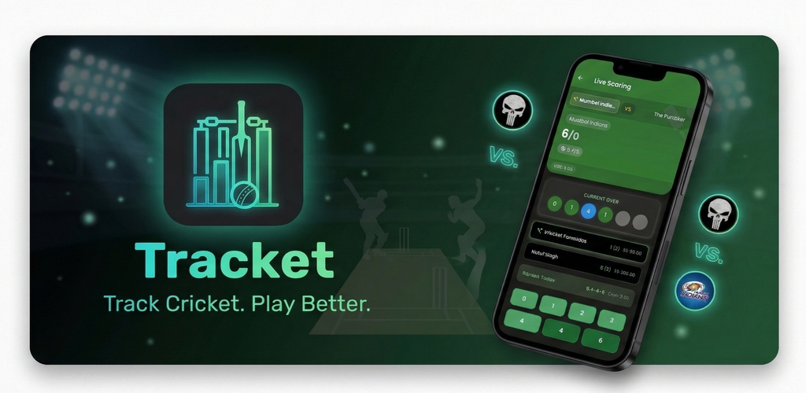
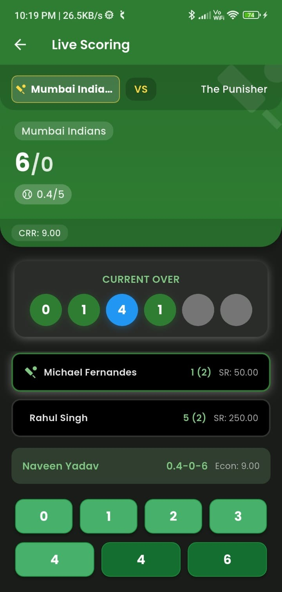
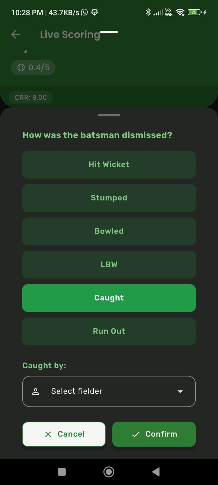
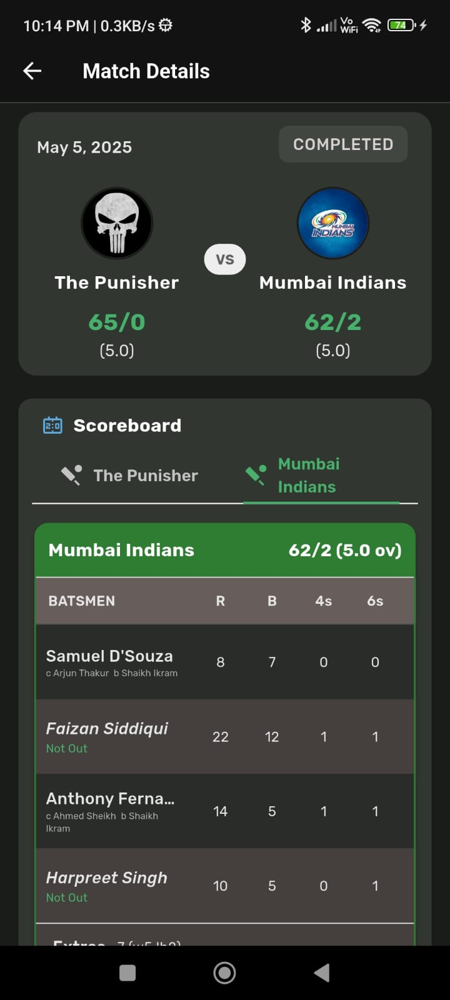
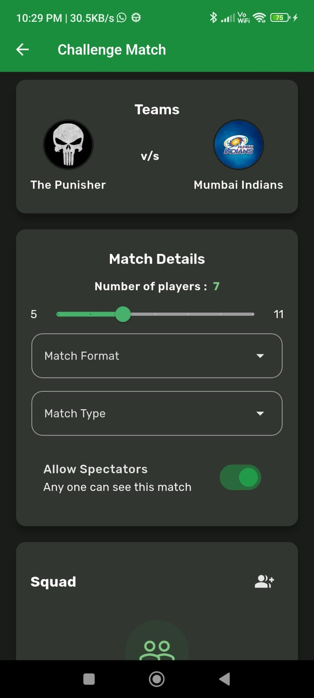
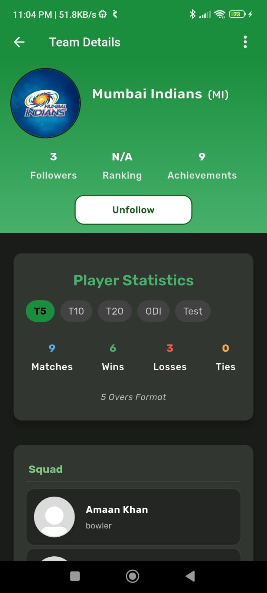
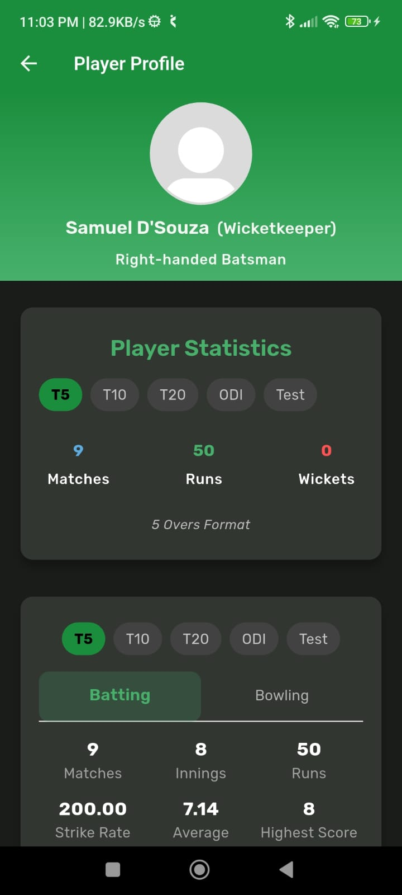

<div align="center">



# Tracket

**Track Cricket. Play Better.**

[](https://play.google.com/store/apps/details?id=com.ikramkolekar.tracket)
[](https://flutter.dev)
[](https://firebase.google.com)
[](https://riverpod.dev)
[](https://play.google.com/store/apps/details?id=com.ikramkolekar.tracket)

Tracket is a cricket match tracker and team management app — built for players who take the game seriously. Score matches ball-by-ball, build your squad, challenge rival teams, and watch your stats grow across every format.

[**Download on Play Store**](https://play.google.com/store/apps/details?id=com.ikramkolekar.tracket) · [**Watch Demo**](https://youtu.be/e38Fbj-7A4E?si=sWR5yv9g72UbD617)

</div>

---

## Screenshots

<div align="center">

| Live Scoring | Dismissal Modal | Match Details |
|:---:|:---:|:---:|
|  |  |  |

| Challenge Match | Team Details | Player Profile |
|:---:|:---:|:---:|
|  |  |  |

</div>

---

## Features

### Live Scoring
Score every delivery in real time — runs, extras, wickets, current over, current run rate, and fall of wickets all update instantly. The scoring operator controls the match from a dedicated screen while teammates and spectators follow along.

### Ball-by-ball Tracking
Every ball is logged with its outcome. Dismissals capture the full picture — bowled, caught (with fielder), LBW, stumped, run out, and more. Nothing gets lost between overs.

### Team Management
Create a team, set a logo, define your squad capacity, and manage roles (owner / admin / player). Teams can be public or private. Players discover and join public teams through the Explorer. Owners issue and accept join requests.

### Match Challenges
Challenge any team to a match directly from the app. Define the format (T5, T10, T20, ODI, Test), number of players (5–11), and match type (Friendly, Practice, Challenge). The opponent receives a notification and picks their playing XI before the toss.

### Player Profiles & Statistics
Every player has a profile with their batting and bowling stats broken down by format. Stats — matches, innings, runs, average, strike rate, wickets, economy — update automatically after each completed match. Players can follow each other to stay connected.

### Notifications & Requests
An in-app notification centre handles follow requests, team join requests, match challenges, and player offers. Accept or reject from a single, unified screen with tabs for each notification type.

### Multi-format Support
T5 · T10 · T20 · ODI · Test — each format tracked separately so a player's T20 record never pollutes their Test average.

### Dark / Light Theme
Full dark and light theme support, persisted across sessions.

---

## Tech Stack

| Layer | Technology |
|---|---|
| Framework | Flutter 3.4+ |
| Language | Dart (null-safe) |
| State Management | Flutter Riverpod |
| Backend / Database | Firebase Firestore |
| Authentication | Firebase Auth + Google Sign-In |
| Image Storage | ImageKit.io |
| Local Storage | SharedPreferences |
| Animations | flutter_animate, Lottie, Confetti |
| Fonts | Google Fonts |

---

## Architecture

The project follows **feature-first clean architecture**. Each feature is self-contained with its own screens, models, services, and providers.

```
lib/
├── features/
│   ├── authentication/   # Auth gate, login, onboarding
│   ├── home/             # Navigation, drawer, theme provider
│   ├── teams/            # CRUD, squad, explorer, join requests
│   ├── matches/          # Creation, toss, live scoring, scorecard
│   ├── players/          # Profiles, stats, follow system
│   └── notifications/    # Challenges, requests, follow alerts
├── common/               # Shared widgets, theme, screens
└── utils/                # Constants, helpers, validators, cloud storage
```

---

## Getting Started

### Prerequisites

- Flutter SDK `>=3.4.0`
- Dart SDK `>=3.4.0`
- Firebase project with Firestore and Auth enabled
- ImageKit account (for image uploads)

### Clone & Install

```bash
git clone https://github.com/your-username/tracket.git
cd tracket
flutter pub get
```

### Environment Variables

Create a `.env` file at the project root:

```env
IMAGEKIT_PUBLIC_KEY=your_public_key
IMAGEKIT_PRIVATE_KEY=your_private_key
IMAGEKIT_URL_ENDPOINT=your_url_endpoint
```

### Firebase Setup

Add your `google-services.json` (Android) and `GoogleService-Info.plist` (iOS) from the Firebase Console.

### Run

```bash
flutter run
```

> This project uses FVM for SDK version pinning. If you have FVM installed:
> ```bash
> fvm install && fvm flutter pub get && fvm flutter run
> ```

### Build

```bash
# Android APK
flutter build apk --release

# Android App Bundle
flutter build appbundle --release
```

---

## Download

<div align="center">

[](https://play.google.com/store/apps/details?id=com.ikramkolekar.tracket)

</div>

---

## Demo

[](https://youtu.be/e38Fbj-7A4E?si=sWR5yv9g72UbD617)

Click the thumbnail to watch the full demo on YouTube.

---

## License

This project is for personal and portfolio use. All rights reserved © Ikram Kolekar.
